Whole-run metrics
=================

This section presents metrics about the whole run of each program, *e.g.* its duration, the total count of its I/Os, the total number of page faults, *etc.*

Duration *vs.* parallelism
--------------------------

Probably the most intuitive metric, this graph shows the duration of each program according to the number of threads used to run it.
Durations are normalized to the single-thread duration.

The thin dashed lines are representations of [Amdahl's law](https://en.wikipedia.org/wiki/Amdahl%27s_law) for $p$ (the parallel portion) varying from 10% to 100%.

The left-side graph is just a zoomed view of the other graph, for low parallelisms.

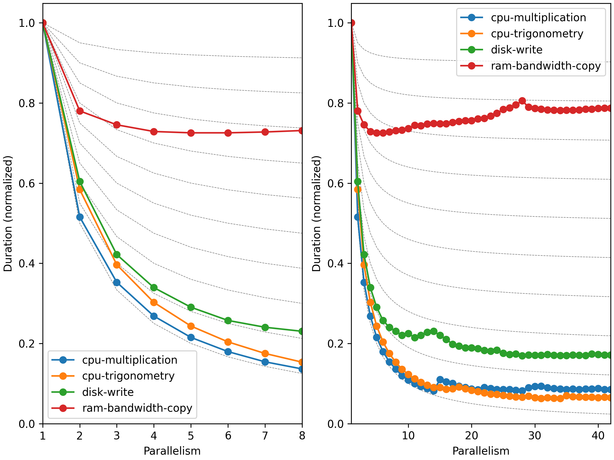

System and user times vs. parallelism
-------------------------------------

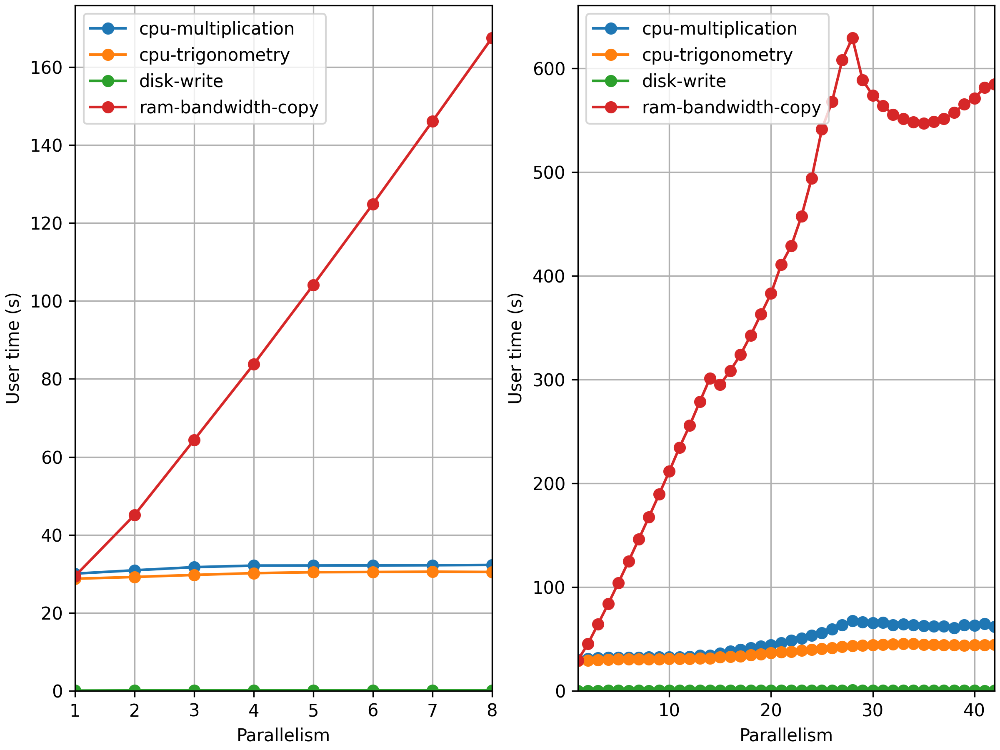

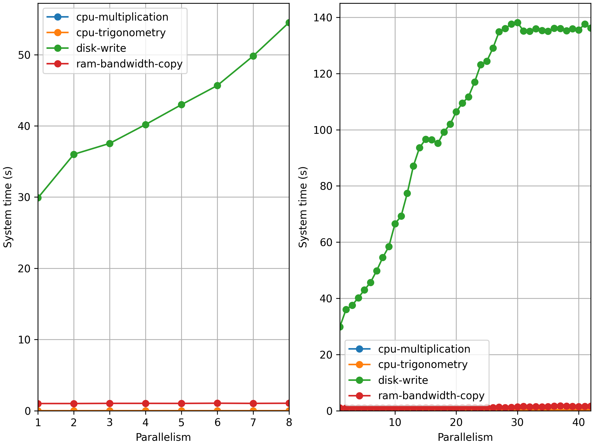

Page faults vs. parallelism
---------------------------

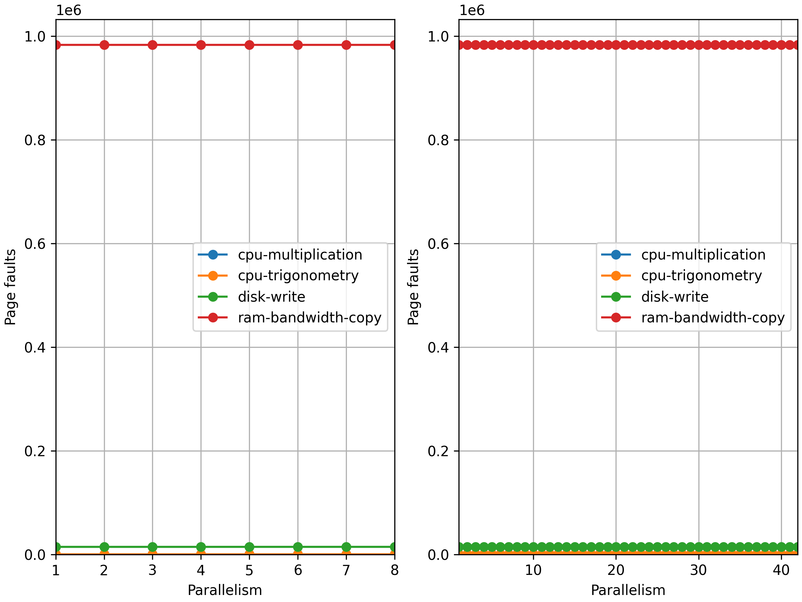

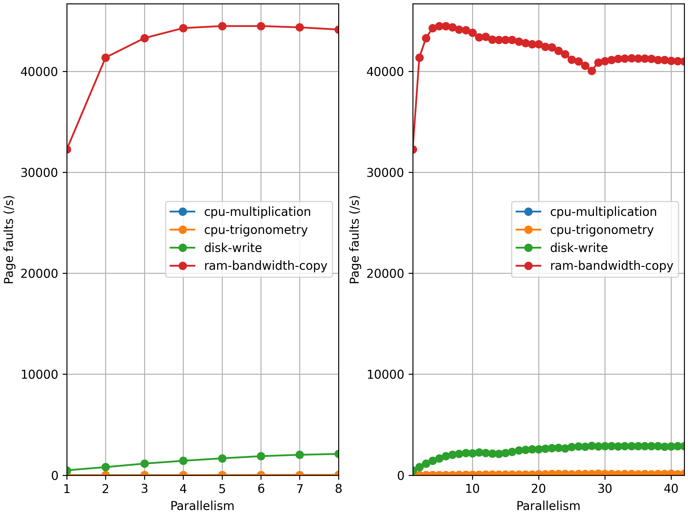

Outputs vs. parallelism
-----------------------

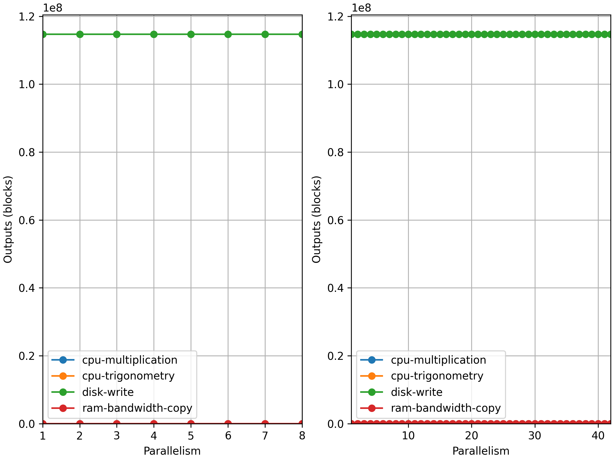

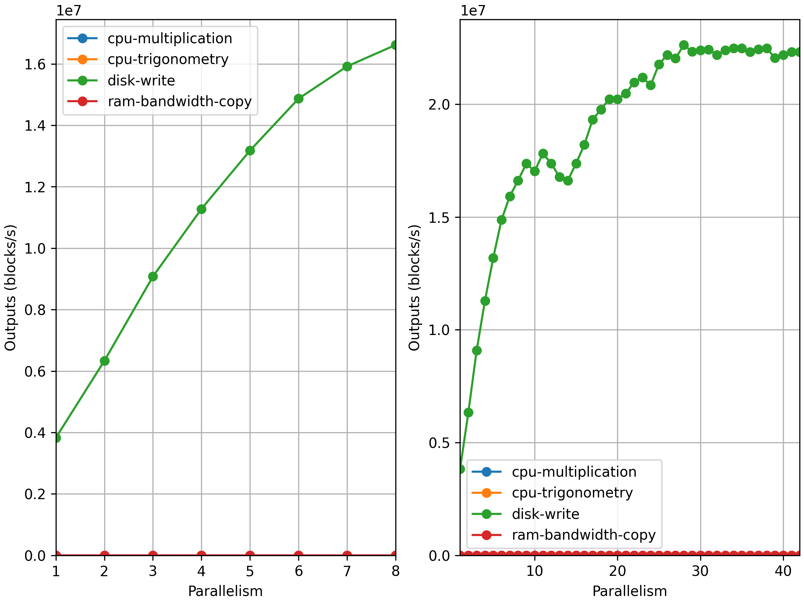

Context switches vs. parallelism
--------------------------------

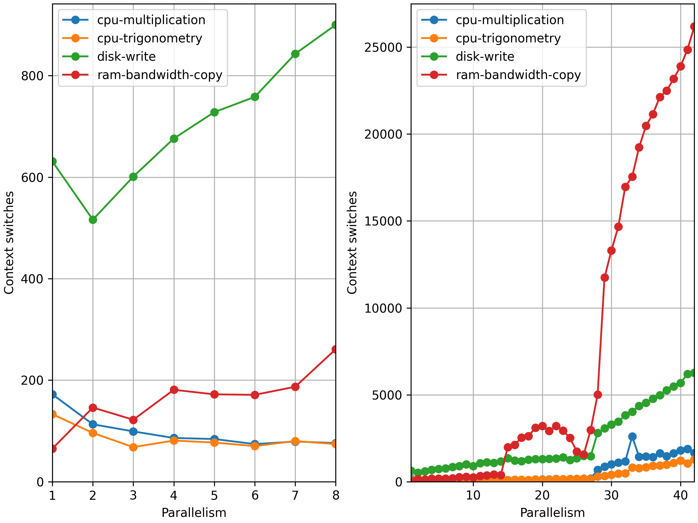

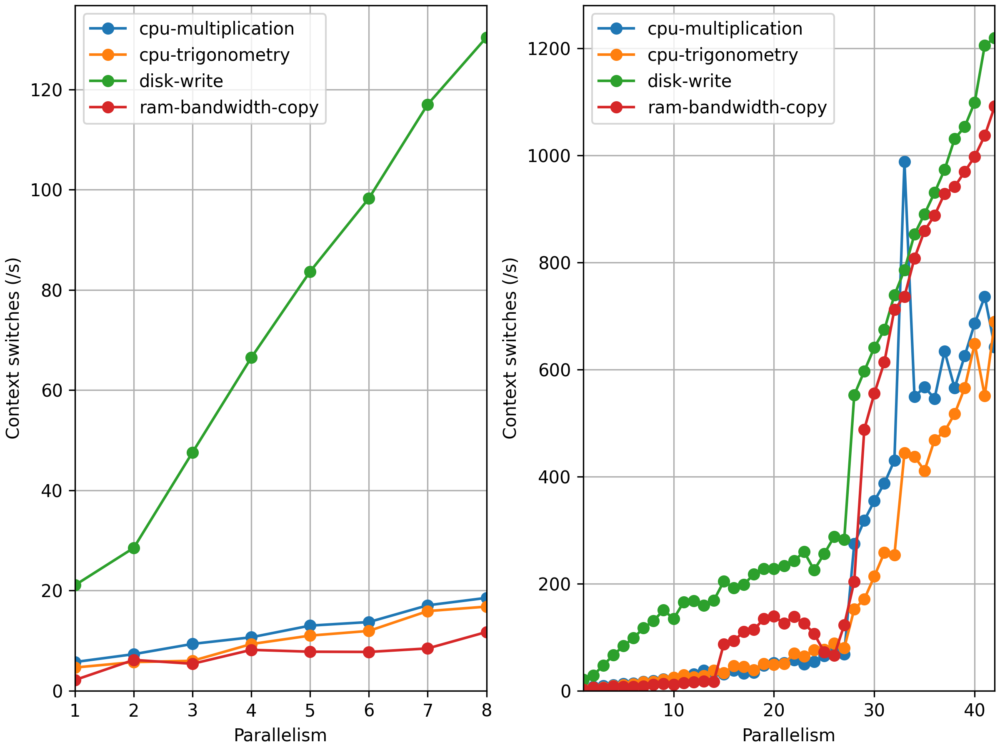

Instant metrics
===============

This section presents metrics recording all along during the execution, like instant CPU usage or output rate.

CPU usage
---------

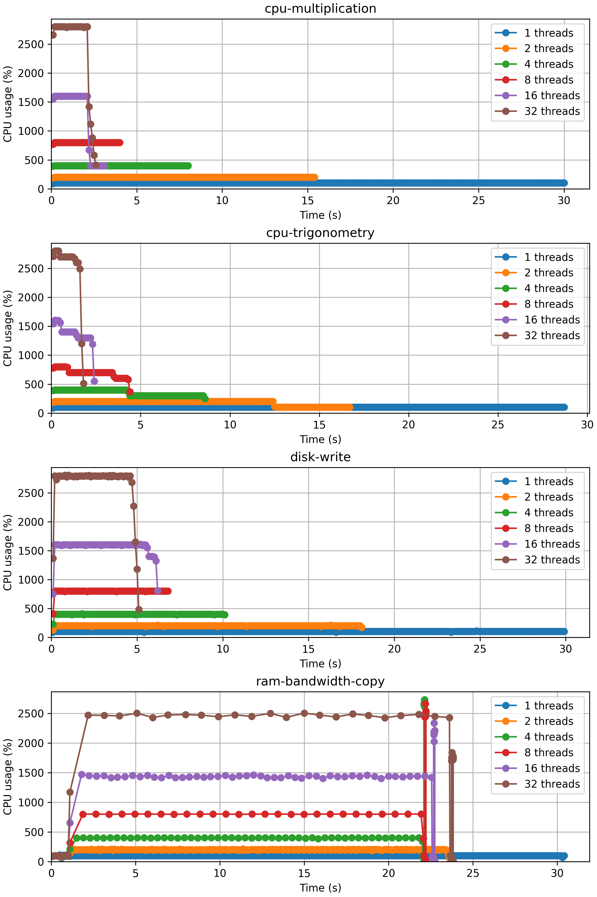

Memory usage
------------

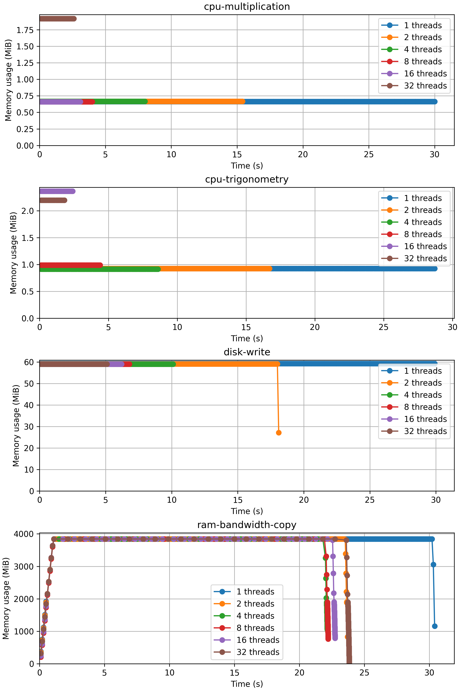

Outputs
-------

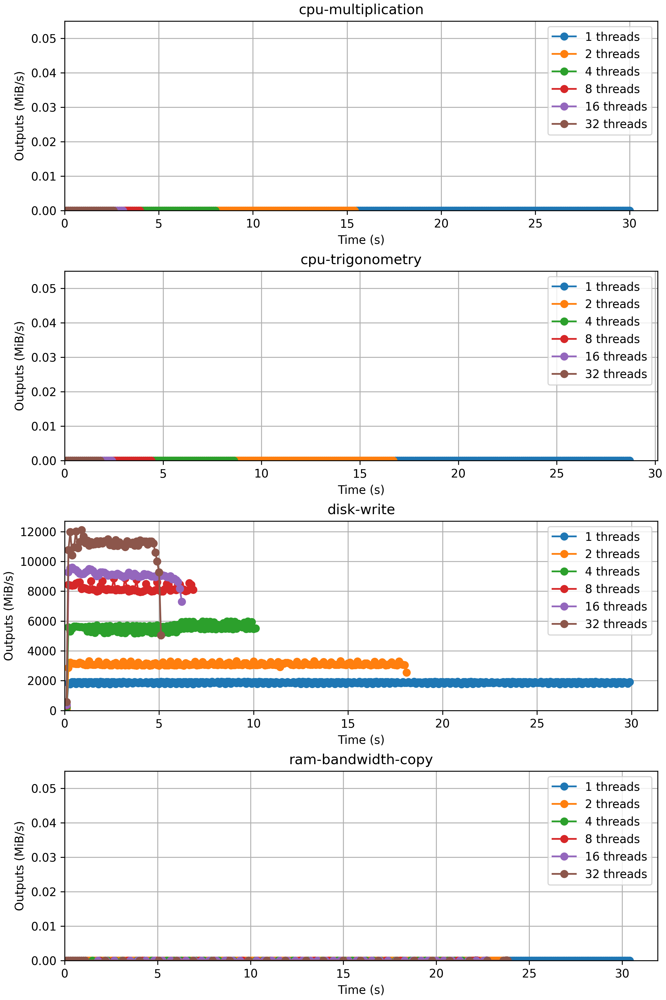
